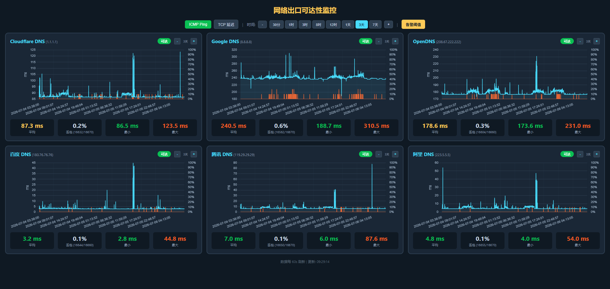

# NetPulse - 网络出口可达性监控

[](https://www.python.org/)
[](https://flask.palletsprojects.com/)
[](LICENSE)

> 从 Linux 边缘节点向外定时探测出口 IP 的可达性、延迟与丢包率，覆盖三大运营商 × 五大地区，提供 Web 仪表盘实时查看与告警。

## 功能特性

- **双协议探测** — ICMP Ping 测量网络层 RTT 与丢包；TCP 握手测量传输层连接延迟
- **多维度覆盖** — 6 个海内外 DNS 基准（ICMP）+ 15 个目标覆盖 电信/联通/移动 × 华北/华东/华南/华中/华西（TCP）
- **实时仪表盘** — 折线图 + 地区×运营商矩阵表，每张图独立缩放（10分钟~180天）、鼠标悬停查看数值
- **告警阈值** — 逐目标设置延迟/丢包上限，超限卡片红色泛光提醒
- **轻量部署** — 单 Python 文件 + SQLite，`pip install flask` 即跑，不依赖外部数据库
- **多机对比** — 同一套代码部署到多台 Linux，横向对比不同网络出口质量

## 截图预览



打开浏览器访问面板后，可在「ICMP Ping」和「TCP 延迟」两个 Tab 之间切换：

- **ICMP**：各目标延迟/丢包趋势图 + 当前窗口聚合统计
- **TCP**：地区×运营商延迟矩阵 + 每目标独立折线图 + 平均值/最小/最大

## 检测维度

| 维度 | 协议 | 指标 | 目标数 |
|------|------|------|--------|
| 海外/国内基准 | ICMP Ping | 可达性、延迟、丢包 | 6 |
| 三大运营商 x 五地区 | TCP 握手 | TCP 连接延迟、可达性 | 15 |

### ICMP 目标

| 名称 | 地址 | 说明 |
|------|------|------|
| Google DNS | 8.8.8.8 | 海外可达性基准 |
| Cloudflare DNS | 1.1.1.1 | 海外可达性基准 |
| 阿里 DNS | 223.5.5.5 | 国内可达性基准 |
| 腾讯 DNS | 119.29.29.29 | 国内可达性基准 |
| OpenDNS | 208.67.222.222 | 海外可达性辅助 |
| 百度 DNS | 180.76.76.76 | 国内可达性基准 |

### TCP 目标矩阵 (地区 x 运营商)

| 地区 | 电信 | 联通 | 移动 |
|------|------|------|------|
| 华北 | www.189.cn:443 | www.10010.com:443 | www.bj.10086.cn:443 |
| 华东 | www.sh.189.cn:443 | www.baidu.com:443 | www.sh.10086.cn:443 |
| 华南 | www.gd.189.cn:443 | www.qq.com:443 | www.gd.10086.cn:443 |
| 华中 | www.sina.com.cn:443 | www.sohu.com:443 | www.163.com:443 |
| 华西 | www.taobao.com:443 | www.jd.com:443 | www.bilibili.com:443 |

## 目录结构

```
network-monitor/
├── config.json              # 监控配置
├── monitor.py               # 采集模块（ping + TCP + SQLite 存储）
├── web.py                   # Web 面板（Flask REST API）
├── requirements.txt         # Python 依赖
├── run.sh                   # 启停脚本
├── static/                  # Web 前端
│   └── index.html           #   仪表盘页面
└── README.md
```

## 服务器部署目录

```
/opt/network-monitor/        # 部署根目录
├── .venv/                   # Python 虚拟环境（自动创建）
├── config.json
├── monitor.py
├── web.py
├── requirements.txt
├── run.sh
├── logs/                    # 运行日志（按天分割）
│   └── monitor-YYYYMMDD.log
├── data/                    # 监控数据
│   └── monitor.db           #   SQLite 数据库
├── monitor.pid              # 进程 PID 文件
└── static/
    └── index.html
```

## 快速开始

### 1. 准备 Linux 服务器

确保已安装 Python 3.8+：

```bash
python3 --version
# 如果缺少 venv 模块（Ubuntu/Debian）：
apt install python3-venv
```

### 2. 上传并部署

```bash
# 打包
tar -czf deploy.tar.gz --exclude='*.tar.gz' *

# 上传到目标服务器（替换为实际地址）
scp deploy.tar.gz user@your-server:/tmp/

# 解压并启动
ssh user@your-server \
  "mkdir -p /opt/network-monitor && cd /opt/network-monitor && tar -xzf /tmp/deploy.tar.gz && chmod +x run.sh && ./run.sh start"
```

### 3. 访问面板

浏览器打开 `http://<服务器IP>:8080`

## 配置说明 (config.json)

| 字段 | 说明 | 默认值 |
|------|------|--------|
| `icmp_targets` | ICMP 检测目标列表 | 6 个公网 DNS |
| `tcp_targets` | TCP 检测目标列表（含 region/isp） | 15 个（5地区×3运营商） |
| `ping_count` | 每轮 ping 发包数 | 10 |
| `ping_timeout` | 单次 ping 超时（秒） | 5 |
| `tcp_timeout` | TCP 连接超时（秒） | 5 |
| `interval_seconds` | 检测间隔（秒） | 60 |
| `data_dir` | 数据存储目录 | `./data` |
| `web.host` | Web 监听地址 | `0.0.0.0` |
| `web.port` | Web 监听端口 | `8080` |

## 运维命令

```bash
# 进入部署目录
cd /opt/network-monitor

# 启动
./run.sh start

# 停止
./run.sh stop

# 重启
./run.sh restart

# 查看状态
./run.sh status

# 查看日志
./run.sh log
```

## API 接口

| 接口 | 方法 | 说明 |
|------|------|------|
| `/` | GET | Web 仪表盘页面 |
| `/api/icmp/status` | GET | ICMP 历史数据（支持 `?minutes=` 参数） |
| `/api/tcp/status` | GET | TCP 历史数据（支持 `?minutes=` 参数） |
| `/api/tcp/summary` | GET | TCP 汇总（平均/最小/最大延迟） |
| `/api/reachable_summary` | GET | ICMP 可用率汇总 |
| `/api/ping_now` | GET | 立即执行 ICMP 检测 |
| `/api/tcp_now` | GET | 立即执行 TCP 检测 |
| `/api/config` | GET/POST | 查看/修改配置 |

## 依赖

- **Linux 服务器**: Python 3.8+, `python3-venv`
- **本地 Windows**: OpenSSH Client, `tar`
